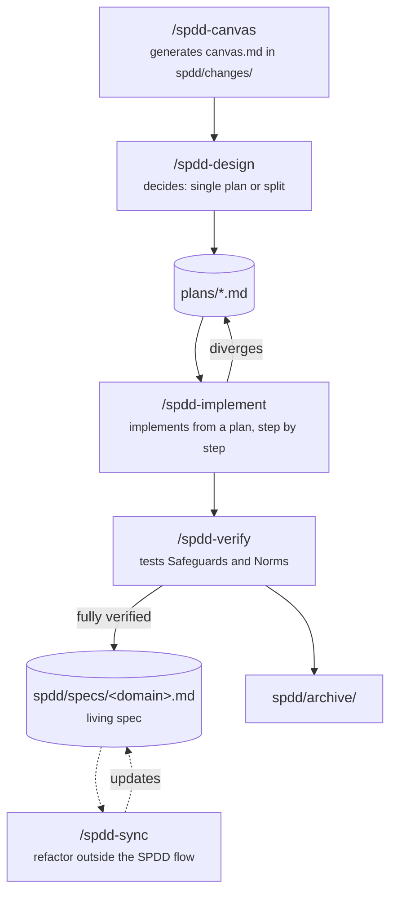

# open-spdd

Structured Prompt-Driven Development (SPDD) skills in the [agentskills.io](https://agentskills.io) format. Work with Claude Code, OpenAI Codex, VS Code Copilot, and any compatible agent.

## Skills

| Skill | Trigger | Description |
|---|---|---|
| `spdd-canvas` | `/spdd-canvas` | Generates a REASONS canvas before writing code |
| `spdd-design` | `/spdd-design` | Splits a canvas into one or more independent implementation plans |
| `spdd-implement` | `/spdd-implement` | Implements a feature from a plan produced by `spdd-design` |
| `spdd-verify` | `/spdd-verify` | Verifies an implementation, tests edge cases, folds it into the living spec, and archives it |
| `spdd-sync` | `/spdd-sync` | Syncs a behavior-preserving code refactor back into the living spec |
| `spdd-migrate` | `/spdd-migrate` | One-time migration from the old flat `docs/prompts/` layout to `spdd/` |

## Installation

```bash
npx skills add edezacas/open-spdd
```

Restart Claude Code to pick up the new skills.

<details>
<summary>Manual installation</summary>

```bash
git clone git@github.com:edezacas/open-spdd.git ~/projects/open-spdd
mkdir -p ~/.claude/skills
ln -s ~/projects/open-spdd/spdd-canvas ~/.claude/skills/spdd-canvas
ln -s ~/projects/open-spdd/spdd-design ~/.claude/skills/spdd-design
ln -s ~/projects/open-spdd/spdd-implement ~/.claude/skills/spdd-implement
ln -s ~/projects/open-spdd/spdd-verify ~/.claude/skills/spdd-verify
ln -s ~/projects/open-spdd/spdd-sync ~/.claude/skills/spdd-sync
ln -s ~/projects/open-spdd/spdd-migrate ~/.claude/skills/spdd-migrate
```

</details>

## Workflow

> Canvas format based on [Structured Prompt-Driven Development](https://martinfowler.com/articles/structured-prompt-driven/) by Martin Fowler. Folder lifecycle (`specs/` → `changes/` → `archive/`) and `WHEN/THEN` requirement scenarios inspired by [OpenSpec](https://github.com/Fission-AI/OpenSpec).



```
/spdd-canvas magic link authentication
```

Generates a REASONS canvas at `spdd/changes/SPDD-YYYY-MM-DD-HHMM-slug/canvas.md`, after checking `spdd/specs/` for existing related behavior. Once reviewed, run:

```
/spdd-design
```

This is a required step — `spdd-implement` never implements directly from the canvas. `spdd-design` decides internally whether the canvas's Operations are cleanly separable and need splitting into several independent plans under `plans/` (each with its own `Depends on:` and `Shared touchpoints:`, useful when you plan to hand different plans to different agents), or whether the whole canvas is simple enough to stay as a single plan. Either way, it always produces at least one plan.

```
/spdd-implement
```

Reads the canvas and the chosen plan, checks for unresolved `⚠️ Confirm:` items and unmet plan dependencies, implements step by step, and updates the canvas or plan if anything diverges. Stops and asks you to run `/spdd-design` first if no plan exists yet.

```
/spdd-verify
```

Checks every Operation is implemented, every Norm followed, and writes targeted tests for any Safeguards edge case not already covered. Once everything for a change is verified, folds it into `spdd/specs/<domain>.md` and moves it to `spdd/archive/`.

Separately, whenever code that already has a spec gets refactored **outside** this flow (a rename, an extracted constant — no behavior change):

```
/spdd-sync
```

Compares the current code against `spdd/specs/<domain>.md` and updates Entities/Structure/Operations/Norms to match. It never touches the `WHEN/THEN` Requirements on its own — if the diff looks like it changes behavior, it stops and tells you to use `/spdd-canvas` instead.

> **Migrating from `docs/prompts/`:** if you installed an earlier version of these skills, run `/spdd-migrate` once in that project. It moves canvases from `docs/prompts/SPDD-*.md` into `spdd/changes/SPDD-.../canvas.md`, rewrites Acceptance Criteria/Safeguards into `WHEN/THEN`, keeps each canvas's original `Status` (an old `Implemented` canvas stays `Implemented` — run `/spdd-verify` on it whenever you want it folded into `spdd/specs/`), and updates the guard hook to the new path. It's non-destructive and idempotent: the original files are left in place unless you confirm deletion, and running it again skips whatever was already migrated.

## Other agents

Skills follow the agentskills.io format (`SKILL.md` + standard frontmatter). Place or symlink skill folders into `.agents/skills/` and any compatible agent discovers them automatically. For agents without native support (Cursor, Windsurf), paste the `SKILL.md` contents into the agent's rules file.

## License

[MIT](LICENSE)
